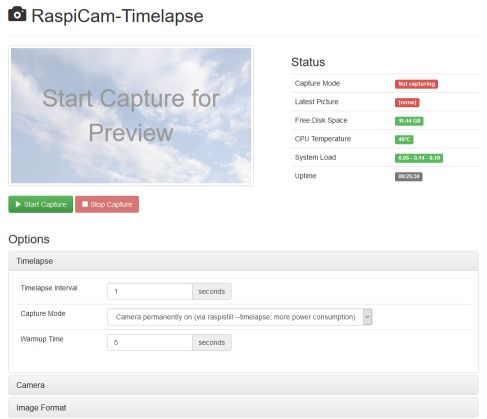

RaspiCam-Timelapse
==================

Simple Web-App and complete HowTo for setting up a Raspberry Pi with Camera for Time-lapse Photography.

- [Node.js](https://nodejs.org/) based Web-App for controlling and monitoring the camera and the Raspberry Pi
- Reverse-SSH-Tunnel to another server - reach your Raspberry Pi behind firewalls (optional)
- Dynamic-DNS-Client - find your Raspberry Pi easier in your local network (optional)
- Wi-Fi autoconnect - if you have a USB Wi-Fi Adapter (optional)
- Network-Watchdog - reset network and maybe emergency-reboot if connection is broken (optional)
- BitTorrent-Sync - as sync-solution to get the photos out of the Pi (optional)
- Sync-Script - via rsync as alternative to BitTorrent-Sync (optional)
- Prerequisites: Raspberry Pi + Power + SD-Card, RaspiCam, LAN Cable, USB Wi-Fi Adapter (optional)



<!-- START doctoc generated TOC please keep comment here to allow auto update -->
<!-- DON'T EDIT THIS SECTION, INSTEAD RE-RUN doctoc TO UPDATE -->
**Table of Contents**  *generated with [DocToc](https://github.com/thlorenz/doctoc)*

- [HowTo](#howto)
  - [Setup SD-Card](#setup-sd-card)
  - [Setup Raspbian + Raspberry Pi Camera](#setup-raspbian--raspberry-pi-camera)
  - [Setup RaspiCam-Timelapse](#setup-raspicam-timelapse)
  - [Reverse SSH-Tunnel (optional)](#reverse-ssh-tunnel-optional)
  - [Dynamic-DNS-Client (optional)](#dynamic-dns-client-optional)
  - [Wi-Fi autoconnect (optional)](#wi-fi-autoconnect-optional)
  - [Activate Network-Watchdog (optional)](#activate-network-watchdog-optional)
  - [Use hardware watchdog with Network-Watchdog (optional)](#use-hardware-watchdog-with-network-watchdog-optional)
  - [Install BitTorrent-Sync (optional)](#install-bittorrent-sync-optional)
  - [Install Sync-Script (optional)](#install-sync-script-optional)
    - [Setup config file](#setup-config-file)
    - [Crontab](#crontab)
    - [less strict ssh restrictions needed on your remote server](#less-strict-ssh-restrictions-needed-on-your-remote-server)
  - [Use Ramdisk as primary capture folder (optional)](#use-ramdisk-as-primary-capture-folder-optional)
    - [Additional crontab entries](#additional-crontab-entries)
  - [3G/4G backup connection (optional)](#3g4g-backup-connection-optional)
    - [Setup usb-modeswitch to put modem into ethernet mode](#setup-usb-modeswitch-to-put-modem-into-ethernet-mode)
      - [add udev rule](#add-udev-rule)
    - [Setup interfaces and routing](#setup-interfaces-and-routing)
    - [Add additional tunnels to tunnels.sh (replace `<stick_local_ip>`!)](#add-additional-tunnels-to-tunnelssh-replace-stick_local_ip)
- [TODO](#todo)

<!-- END doctoc generated TOC please keep comment here to allow auto update -->

HowTo
-----

### Setup SD-Card

- Download current [Raspbian](https://www.raspberrypi.org/downloads/raspbian/) ("Jessie" or newer - "Lite" is enough)
- Write extracted ".img"-file to SD-Card - [see OS specific instructions](https://www.raspberrypi.org/documentation/installation/installing-images/README.md)
- Create an empty file named "ssh" in the root folder of the SD-Card to enable automatic startup of OpenSSH
- Attach the camera to the Raspberry Pi - [see instructions](https://www.raspberrypi.org/documentation/configuration/camera.md)
- Put the SD-Card into your Raspberry Pi, Connect to your LAN (DHCP server needed), Power on
- Login via SSH (maybe use local IP): `ssh raspberrypi` (Login: pi / Password: raspberry)
- Make complete SD-Card usable: `sudo raspi-config` - 1 Expand Filesystem - Finish - Reboot


### Setup Raspbian + Raspberry Pi Camera

- Install updates: `sudo apt-get update`, `sudo apt-get dist-upgrade` and `sudo apt-get clean`
- For some helpful optional customizations of your Raspberry Pi - [see here](Raspberry-Customizing.md)
- Enable camera: `sudo raspi-config` - 6 Enable Camera - Enable - Finish  
  (this also sets Memory Split to 128 MB)
- Disable camera LED when taking pictures (optional):  
  `sudo sh -c 'echo "disable_camera_led=1" >> /boot/config.txt'`
- Reboot for the camera settings to take effect: `sudo reboot`


### Setup RaspiCam-Timelapse

Install Node.js (for Node.js >=4.x you need Raspbian "Jessie" or newer - otherwise the native modules won't compile):

```bash
wget https://nodejs.org/dist/v4.4.3/node-v4.4.3-linux-armv6l.tar.xz
tar -xvf node-v4.4.3-linux-armv6l.tar.xz
sudo cp -R node-v4.4.3-linux-armv6l/{bin,include,lib,share} /usr/local/
rm -rf node-v4.4.3-linux-armv6l
```

Install GIT:

```bash
sudo apt-get install git
```

Check out this repository:

```bash
cd ~
git clone https://github.com/not-implemented/raspicam-timelapse.git
cd raspicam-timelapse
npm install
```

Configuration:

```bash
# Create a self-signed certificate:
openssl req -x509 -days 3650 -sha256 -nodes -newkey rsa:2048 -keyout config/timelapse.key -out config/timelapse.crt
chmod og= config/timelapse.key

# Prepare capture directory:
mkdir ../capture
```

Start server:

```bash
npm start &
```

... now open your browser - i.e. with https://raspberrypi:4443/ or IP address (Login: timelapse / Password: timelapse) :-)

Enable start on reboot:

```bash
crontab -e

# Insert this line into crontab:
@reboot /usr/local/bin/node ~/raspicam-timelapse/server.js &
```


### Reverse SSH-Tunnel (optional)

Be sure, to change the default password before allowing connections from untrusted
networks - [see here](Raspberry-Customizing.md).

Generate SSH-Key on Raspberry Pi (just press ENTER everywhere):

```bash
cd ~
ssh-keygen -t rsa

# Show the public key for using later:
cat ~/.ssh/id_rsa.pub
```

Allow SSH connections from Raspberry Pi on your remote server:

```bash
# Maybe add a new user - i.e. "timelapse" on your remote server (but you can use an existing one):
adduser --gecos Timelapse timelapse
chmod go-rwx /home/timelapse
cd /home/timelapse

# Add the raspberry's key (.ssh/id_rsa.pub from above) on your remote server
# to the user and just allow port-forwarding (no login):
mkdir -p .ssh
echo "command=\"echo 'This account can only be used for port-forwarding'\",no-agent-forwarding,no-pty,no-X11-forwarding" \
    "{raspberry-public-key-from-above}" >> .ssh/authorized_keys
chmod -R go-rwx .ssh
chown -R timelapse:timelapse .ssh

# Some global settings:
editor /etc/ssh/sshd_config

# Enable listening on all interfaces for port-forwarding on your remote server
# (otherwise port-forwarding will listen only on localhost):
GatewayPorts yes

# Detect and close dead connections faster and close forwarded ports to reuse them:
ClientAliveInterval 30
ClientAliveCountMax 3

# Restart SSH server:
service sshd restart
```

Back on Raspberry Pi: Configure tunnels to be established - create a script with
`editor tunnels.sh` like the following example to forward port 10022 from your
remote server to port 22 on Raspberry Pi - same with port 4443 and 8888:

```bash
#!/bin/bash

~/raspicam-timelapse/ssh-reverse-tunnel/open-tunnel.sh timelapse@www.example.com 10022 22 &
~/raspicam-timelapse/ssh-reverse-tunnel/open-tunnel.sh timelapse@www.example.com 4443 4443 &
~/raspicam-timelapse/ssh-reverse-tunnel/open-tunnel.sh timelapse@www.example.com 18888 8888 &
```

```bash
# Make it executable:
chmod +x tunnels.sh

# Check SSH-Connection and permanently add the key (type "yes"):
ssh timelapse@www.example.com
# (... should print "This account can only be used for port-forwarding" and close SSH connection)

# Add script to crontab:
crontab -e

# Insert this lines into crontab:
@reboot ~/tunnels.sh
* * * * * ~/tunnels.sh
```


### Dynamic-DNS-Client (optional)

```bash
# Link script:
sudo ln -snf /home/pi/raspicam-timelapse/dynamic-dns-client/lib_dhcpcd_dhcpcd-hooks_90-dynamic-dns /lib/dhcpcd/dhcpcd-hooks/90-dynamic-dns

# Change config vars in dynamic-dns.conf:
sudo editor ~/raspicam-timelapse/dynamic-dns-client/dynamic-dns.conf
```


### Wi-Fi autoconnect (optional)

```bash
sudo editor /etc/wpa_supplicant/wpa_supplicant.conf
```

Append as many networks as you want - some examples:

```
# Secure Wi-Fi example:
network={
    ssid="{your-ssid}"
    psk="{your-key}"
}

# Open Wi-Fi example:
network={
    ssid="muenchen.freifunk.net"
    key_mgmt=NONE
}
```


### Activate Network-Watchdog (optional)

```bash
crontab -e

# Insert this line into crontab:
* * * * * sudo timeout -k 120 100 ~/raspicam-timelapse/network-watchdog/check-network.sh

# To enable the watchdog set IPV4_ENABLED=1 and/or IPV6_ENABLED=1 - default ping destination
# is the default gateway - override via IPV4_PING_DEST/IPV6_PING_DEST when needed:
cp ~/raspicam-timelapse/config/check-network.conf.example ~/raspicam-timelapse/config/check-network.conf
editor ~/raspicam-timelapse/config/check-network.conf
```

### Use hardware watchdog with Network-Watchdog (optional)

`apt-get install watchdog`  
`sudo editor /etc/default/watchdog`  
```diff
-watchdog_module="none"
+watchdog_module="bcm2708_wdog"
```
`sudo mkdir /etc/watchdog.d`
```
# To enable the watchdog set IPV4_ENABLED=1 and/or IPV6_ENABLED=1 - default ping destination
# is the default gateway - override via IPV4_PING_DEST/IPV6_PING_DEST when needed:
cp ~/raspicam-timelapse/config/check-network.conf.example ~/raspicam-timelapse/config/check-network.conf
editor ~/raspicam-timelapse/config/check-network.conf
sudo ln -s ~/raspicam-timelapse/network-watchdog/check-network.sh /etc/watchdog.d/
```
`systemctl enable watchdog`  

### Install BitTorrent-Sync (optional)

We currently use BitTorrent-Sync as sync-solution, because Syncthing is very slow on Raspberry Pi.

```bash
wget https://download-cdn.getsync.com/stable/linux-arm/BitTorrent-Sync_arm.tar.gz
mkdir btsync && cd btsync
tar -xvzf ../BitTorrent-Sync_arm.tar.gz

# Start BitTorrent-Sync:
./btsync --webui.listen 0.0.0.0:8888
cd ..

# Enable start on reboot:
crontab -e
@reboot ~/btsync/btsync --webui.listen 0.0.0.0:8888
```

Now open Web-Interface via "https://raspberrypi:8888/" and add "/home/pi/capture" folder for sync.

After that disable sync of "latest.jpg":

```bash
editor capture/.sync/IgnoreList

# Append to the end:
/latest.jpg
```

### Install Sync-Script (optional)

Second sync method is a [configurable sync script](sync/sync.sh). Currently only tested with rsync.

#### Setup config file
You have to configure some options in sync/sync.conf ([examples](sync/sync.conf.example)) at first 
#### Crontab
```
# add sync script to crontab
crontab -e
*/5 * * * * ~/raspicam-timelapse/sync/sync.sh ~/capture
```
#### less strict ssh restrictions needed on your remote server
You have to modify the authorized_keys line to allow the sync command to be executed
```diff
-command="echo 'This account can only be used for port-forwarding'"
+command=/path/to/command_validation.sh
```
Example for command_validation.sh:
```bash
#!/bin/bash

if [[ "$SSH_ORIGINAL_COMMAND" =~ [\&\;] ]] ;
then
    echo "Error: Invalid character found in command."
    exit 1
fi

case "$SSH_ORIGINAL_COMMAND" in
    rsync*/timelapse/capture*)
        ;;
    *)
        echo "Error: Invalid command over ssh executed."
        exit 1
        ;;
esac

exec $SSH_ORIGINAL_COMMAND
```

### Use Ramdisk as primary capture folder (optional)

To save SD-Cards life, you can capture to a Ramdisk and sync immediately up. Only when sync
does not work for any reason, files are moved to SD-Card and synced up from there.

fstab entry (sudo vim /etc/fstab)
```
capture_ramdisk /home/pi/capture_ramdisk tmpfs size=30M,uid=1000,gid=1000,mode=755 0 0
```
```
mkdir /home/pi/capture_ramdisk
sudo mount /home/pi/capture_ramdisk
```
#### Additional crontab entries
```
# add sync script to crontab
crontab -e
```
```
# sync job for ramdisk
* * * * * ~/raspicam-timelapse/sync/sync.sh ~/capture_ramdisk
# move files older than 3 minutes to sd card
* * * * * ~/raspicam-timelapse/sync/ramdisk2sd-move.sh ~/capture_ramdisk ~/capture
```


### 3G/4G backup connection (optional)

#### Setup usb-modeswitch to put modem into ethernet mode
`sudo apt-get install usb-modeswitch usb-modeswitch-data`

##### add udev rule
```
# Example values for Huawei E303 (please change for your specific device!):
vendor_id=12d1
product_id=1f01
switch_message=55534243123456780000000000000011062000000101000100000000000000

cat <<EOF | sudo tee /etc/udev/rules.d/70-usb-modeswitch.rules > /dev/null
ACTION=="add", SUBSYSTEM=="usb", ATTRS{idVendor}=="$vendor_id", ATTRS{idProduct}=="$product_id", RUN+="/usr/sbin/usb_modeswitch -v $vendor_id -p $product_id -M $switch_message"
EOF

# reload udev:
sudo udevadm control --reload
```

#### Setup interfaces and routing

```bash
cp ~/raspicam-timelapse/config/interfaces-post-up.conf.example ~/raspicam-timelapse/config/interfaces-post-up.conf
editor ~/raspicam-timelapse/config/interfaces-post-up.conf
sudo editor /etc/network/interfaces

# add these lines:
auto eth1
iface eth1 inet dhcp
    post-up /home/pi/raspicam-timelapse/backup-connection/interfaces-post-up.sh
# add dhcp configuration to dhcp config file
cat backup-connection/dhcpcd-to_add.conf | sudo tee -a /etc/dhcpcd.conf
```

**Now plug in your UMTS stick.**

#### Add additional tunnels to tunnels.sh (replace `<stick_local_ip>`!)
```
~/raspicam-timelapse/ssh-reverse-tunnel/open-tunnel.sh timelapse@www.example.com 11022 22 <stick_local_ip> &
```


TODO
----

- Switch to Ansible
- Implement as a systemd service (start on boot, restart on crash, restart raspistill after crash)
- Use NVM for installing Node.js - https://github.com/creationix/nvm
- Get Dynamic-DNS-Client more stable (trigger on IP adress changes, not just on cable plug)
